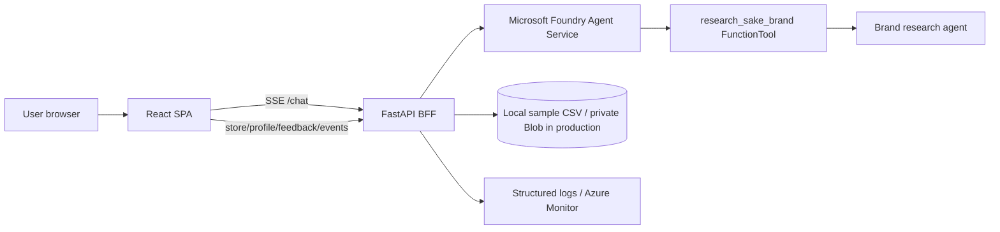

# Sake Concierge / 酒あわせAI

Microsoft Agent Hackathon 2026 提出向けの公開スナップショットです。

店頭 QR や EC から起動し、店舗ラインナップ内の日本酒を推薦する販売支援エージェントです。ユーザーの好み、料理、予算、外部銘柄の好みを受け取り、Microsoft Foundry Agent Service と FastAPI BFF を通じて回答と推薦カードを返します。

## What This Shows

- React + Vite のチャット UI
- FastAPI BFF による `/chat` SSE ストリーミング
- `meta` / `delta` / `status` / `recommendations` / `done` / `error` のイベント分離
- 店舗 CSV 由来の商品カードと公式リンク表示
- `research_sake_brand` FunctionTool による外部銘柄リサーチの接続点
- feedback only の本文保存方針と本文なし KPI イベント
- Azure Container Apps / Managed Identity / Blob Storage を想定した IaC サンプル

## Architecture



## Agentic Workflow

1. ユーザーが好み・料理・予算・外部銘柄を入力します。
2. 店舗ラインナップ内の相談は、注入済み店舗コンテキストから直接推薦します。
3. 店舗外の銘柄が出た場合のみ `research_sake_brand` を使い、味わい傾向を比較軸に変換します。
4. 最終推薦は店舗内商品に限定します。
5. 回答本文とは別に、BFF が商品 ID を抽出して推薦カードを返します。
6. 通常相談は本文なしの構造化ログ、feedback 時だけ簡易マスク済み本文を品質改善用に記録します。

## What Is Intentionally Omitted

- Production secrets and `.env`
- Real production Azure resource names, revision names, image digests, and domains
- Private store catalog data and production Blob Storage layout
- Production prompt details and full evaluation datasets
- Operational logs and one-off investigation notes
- Git history from the private product repository

This repo includes only masked local sample fixtures with product names preserved. Production deployments should load store CSV/Markdown from private Blob Storage using Managed Identity.

## Repository Layout

```text
backend/   FastAPI BFF, Foundry Agent setup script, unit tests
frontend/  React + Vite chat UI, unit/E2E tests
infra/     Bicep / azd deployment sample
backend/src/data/stores/fukunotomo/  public sample fixture used for local demo
evals/     lightweight evaluation scripts and a tiny public golden sample
docs/      public architecture and privacy notes
```

## Local Setup

### Backend

```powershell
cd backend
python -m venv .venv
.\.venv\Scripts\Activate.ps1
pip install -e ".[api,dev,eval]"
Copy-Item .env.example .env
```

Fill these values in `backend/.env` after creating a Foundry Agent:

```text
AZURE_AIPROJECT_ENDPOINT=
AZURE_AGENT_NAME=
AZURE_AGENT_VERSION=
AZURE_OPENAI_DEPLOYMENT_NAME=
```

Create or update the Agent with the local sample store context:

```powershell
python scripts/setup_agent.py --data-dir src/data/stores/fukunotomo
```

Run the API:

```powershell
uvicorn src.api.main:app --reload --port 8000
```

### Frontend

```powershell
cd frontend
npm install
npm run dev
```

Open `http://127.0.0.1:5173/s/fukunotomo`.

## Tests

```powershell
cd backend
python -m pytest tests
python -m ruff check src scripts tests

cd ../frontend
npm test
npm run build
npm run test:e2e
```

## License

MIT


