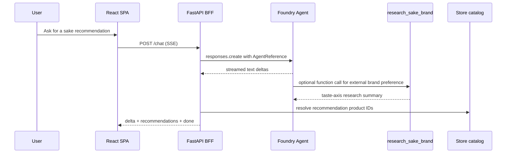

# Architecture Notes

Sake Concierge uses a BFF pattern so the browser never talks to Foundry directly.

## Key Design Choices

- Store data for recommendation is injected into Agent instructions at setup time by `StuffingRetriever`.
- The request-time `/chat` path forwards to an already-created Foundry Agent, avoiding per-request file search setup.
- CSV catalog facts are read separately by the BFF for cards, links, stock labels, and recommendation ID resolution.
- Feedback and analytics are split so normal KPI events do not persist chat text.
- The public sample keeps private catalog data and production prompt details out of Git.
